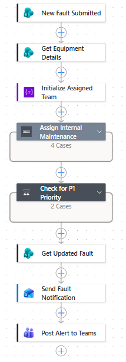
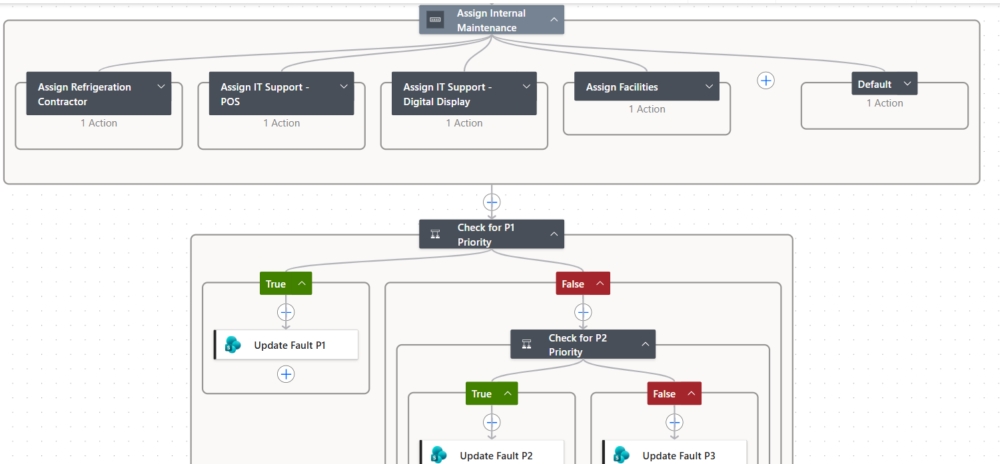
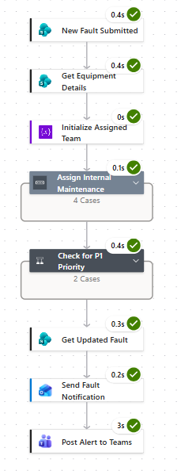
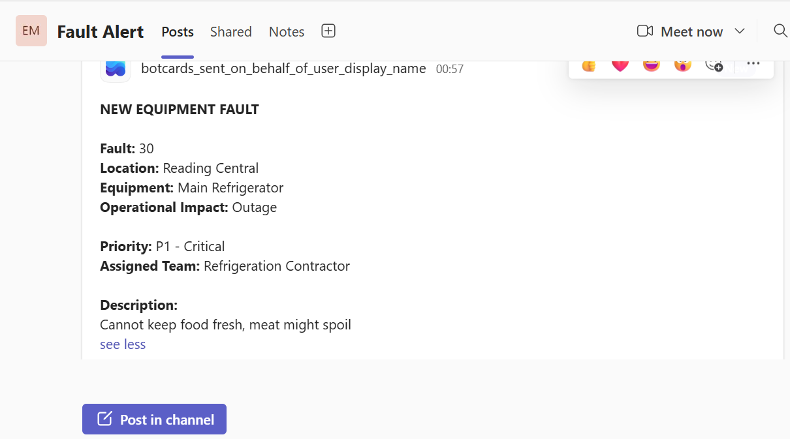
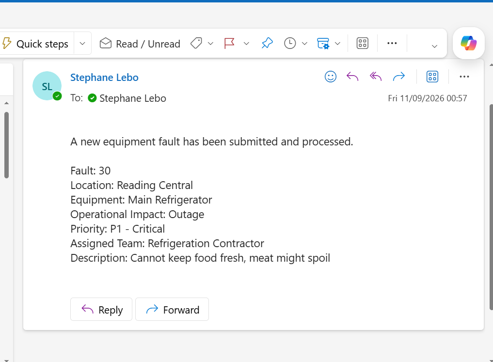

# Power Automate

## Overview

I used Power Automate to automate the processing of a new equipment fault after it is submitted through Power Apps.

The flow is called **`Process New Equipment Fault`**.

I used it to apply the assignment and priority rules, update the fault record, and notify the maintenance team.

## Trigger

The flow starts when a new fault is created in the SharePoint `Faults` list.

```text
Power Apps
    |
    v
SharePoint - New Fault
    |
    v
Power Automate
```

This means the automation begins from the creation of the fault record rather than relying on a user to manually start the process.



*Evidence E09 — overall flow structure from trigger through processing and notifications.*

## Equipment lookup

After the trigger, I use the equipment selected on the fault record to retrieve the associated equipment information.

This is important because equipment criticality is held against the equipment record rather than entered by the user when reporting the fault.

The flow therefore uses the existing equipment data when determining priority.

## Assignment rules

I implemented simple equipment-type-based assignment rules:

| Equipment Type | Assigned team |
|---|---|
| Refrigeration | Refrigeration Contractor |
| POS | IT Support |
| Digital Display | IT Support |
| HVAC | Facilities |
| Other/default | Internal Maintenance |

I used these rules to provide a consistent initial assignment without requiring someone to manually decide which team should receive every new fault.

## Priority rules

I also implemented automated priority determination.

The flow uses **equipment criticality** together with **operational impact**.

The rules are:

- **P1** — Critical equipment and Outage
- **P2** — Outage or Major impact, where the fault is not P1
- **P3** — Remaining faults

The logic therefore gives the highest priority to faults that combine critical equipment with an outage.



*Evidence E10 — implemented assignment and priority decision logic.*

## Updating the fault

Once the assignment and priority have been determined, the flow updates the original SharePoint fault record.

The overall process is:

```text
New Fault
    |
    v
Look up Equipment
    |
    v
Determine Assigned Team
    |
    v
Determine Priority
    |
    v
Update Fault Record
```

This keeps the calculated information with the fault record so that it can be displayed and managed through Power Apps.



*Evidence E11 — successful end-to-end execution of the automation.*

## Notifications

After updating the fault, the flow sends notifications to the maintenance team.

I configured two notification routes:

```text
                    +--> Microsoft Teams
                    |    Fault Alerts
                    |
New Fault --> Flow -+
                    |
                    +--> Outlook
                         Email notification
```

The Teams notification is sent to the **Fault Alerts** channel within the **Equipment Maintenance** team.



*Evidence E12 — automated Teams notification containing the processed fault information.*

I also added an Outlook email notification for the relevant recipients.



*Evidence E13 — automated email notification containing the processed fault information.*

Using both channels provides a simple way of making the new fault visible without requiring maintenance users to constantly check the Power Apps interface.

## Business logic

The key business rules implemented in the flow are:

```text
Assignment
    |
    +-- Equipment Type = Refrigeration --> Refrigeration Contractor
    +-- Equipment Type = POS            --> IT Support
    +-- Equipment Type = Digital Display --> IT Support
    +-- Equipment Type = HVAC           --> Facilities
    +-- Other/default                   --> Internal Maintenance

Priority
    |
    +-- Critical + Outage --> P1
    +-- Outage/Major       --> P2
    +-- Everything else    --> P3
```

I kept the rules relatively simple so that they could be understood, tested and changed without introducing unnecessary complexity into the MVP.

## What I learned

Building the flow helped me understand how a business rule can be separated from the user interface and applied automatically after data is created.

The main design decision was to keep the reporting experience simple in Power Apps while allowing Power Automate to handle the processing that happens afterwards.

I also learned that automation needs to consider the data relationships behind the user interface. The priority decision depends on equipment information that is stored separately from the fault itself, so the flow needs to retrieve that information before applying the rule.

The resulting process is:

```text
Report
  |
  v
Store
  |
  v
Look up data
  |
  v
Apply business rules
  |
  v
Update
  |
  v
Notify
```

This gave me practical experience of connecting a business process across Power Apps, SharePoint, Power Automate, Teams and Outlook.
